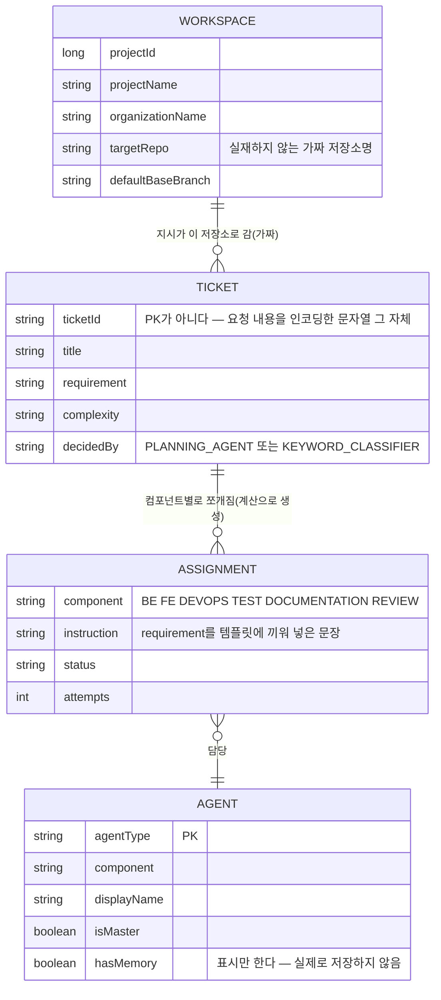

# 데이터 모델 (ERD가 아니라 "응답 모양")

이 서비스에는 **데이터베이스가 없다.** 그래서 엄밀히는 ERD(개체-관계 다이어그램)를 그릴 대상이
없지만, FE(`agent-core-fe`)가 기대하는 응답 모양은 실제 Agent Core의 도메인 모델과 1:1로
대응해야 하므로, 그 "모양"만 문서화한다. 실제 제품의 ERD/BRD는 비공개BE 저장소에 있다 —
여긴 그걸 흉내 낸 응답 스키마일 뿐이다.

## 개념도

## `TICKET`이 테이블이 아닌 이유

실제 제품의 `task_queue`/`component_queue`(비공개BE `ERD.md` 참고)는 진짜 테이블이고
PK로 조회한다. 여긴 서버리스 함수라 요청마다 다른 인스턴스에서 뜰 수 있어 공유 메모리를
믿을 수 없다 — 그래서 **`ticketId` 자체가 데이터다.** `POST /api/office/directive`가
`{projectId, requirement, ts}`를 base64url로 인코딩해 `ticketId`로 돌려주고,
`GET /api/dashboard/assignments?ticketId=`가 그 문자열을 다시 디코딩해서 배분 결과를
매번 같은 방식으로 재계산한다(`lib/tickets.js`). DB 없이 "방금 만든 티켓을 다시 조회할 수
있음"이 재현되는 이유가 이거다.

## 실제 제품과의 대응

| 여기(`agent-core-demo`) | 실제 Agent Core | 다른 점 |
|---|---|---|
| `WORKSPACE` | `project` 테이블 | 실제는 DB row, 여긴 `lib/workspaces.js`의 고정 배열 2개 |
| `TICKET` | `task_queue` 테이블 | 실제는 PK로 조회, 여긴 `ticketId` 문자열 자체가 데이터 |
| `ASSIGNMENT` | `component_queue` 테이블 | 실제는 LLM이 판단, 여긴 해시로 결정론적 선택 |
| `AGENT` | `agents/*.md` 프런트매터 | 실제는 실제 프롬프트/스킬, 여긴 이름만 그럴듯한 더미 값 |
